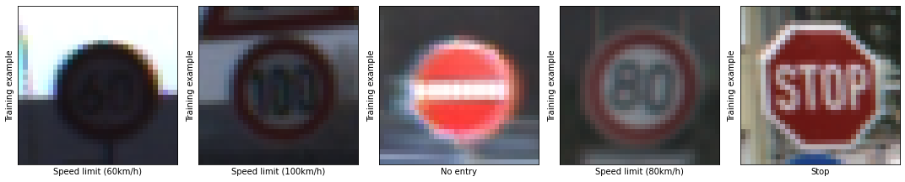
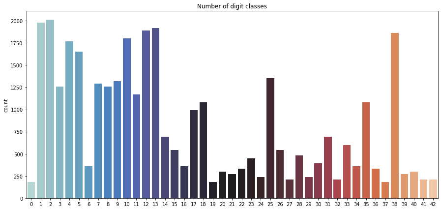
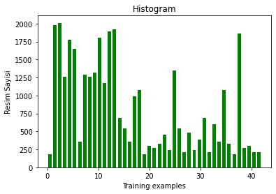
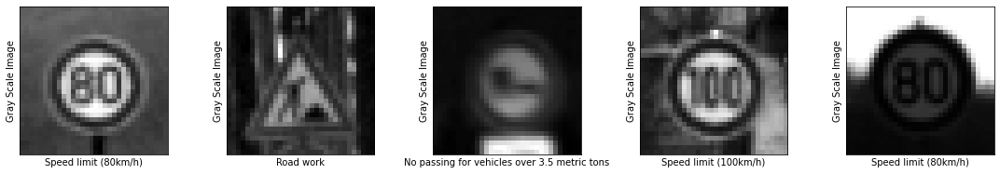
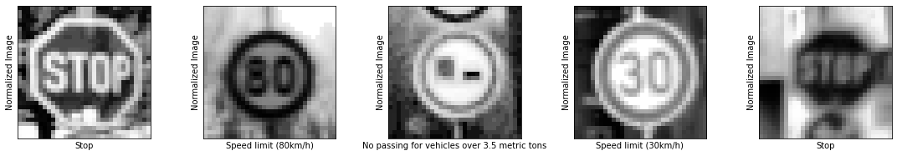

# Traffic Signs Recognition

**In this Python project, we will build a deep neural network model that can classify traffic signs present in the image into different categories. With this model, we are able to read and understand traffic signs which are a very important task for all autonomous vehicles.
**

**Dataset: German Traffic Sign Dataset. **

** Data Set**

Dataset can be download here: 
http://benchmark.ini.rub.de/?section=gtsrb&subsection=dataset

Dataset Overview :

More than 40 classes

More than 50,000 images in total

Physical traffic sign instances are unique within the dataset
(i.e., each real-world traffic sign only occurs once)

## 1-) Loading and Visualise The Data Set

- `train.p`: The training set.
- `test.p`: The testing set.
- `valid.p`: The validation set.

I will use Python `pickle` to load the data.
Dataset Summary & Exploration
The pickled data is a dictionary with 4 key/value pairs:

- `'features'` is a 4D array containing raw pixel data of the traffic sign images, (num examples, width, height, channels).
- `'labels'` is a 1D array containing the label/class id of the traffic sign. The file `signnames.csv` contains id -> name mappings for each id.
- `'sizes'` is a list containing tuples, (width, height) representing the original width and height the image.
- `'coords'` is a list containing tuples, (x1, y1, x2, y2) representing coordinates of a bounding box around the sign in the image.

**Then, I used `matplotlib` plot sample images .**

<figure>
 
 <figcaption>
 

 
 </figcaption>
</figure>

** Then, I used `seaborn` to plot a histogram of the count of images in each unique class.
<figure>
 
 <figcaption>
 

 
 </figcaption>
</figure>

**And finally, I will use `numpy` to plot a histogram of the count of images in each unique class.**
<figure>
 
 <figcaption>
 

 
 </figcaption>
</figure>

## 2-) Data Preprocessing-Normalization,Reshape,Local Histogram Equalization

**Actions to be taken for data preprocessing:
We will be able to perform the most accurate analysis by minimizing unwanted situations with the data preprocessing method.
 (Shuffling, Grayscaling, Local Histogram Equalization, Normalization.)**

**Shuffling: We mix data to increase randomness and diversity.**

**Grayscaling: I will use OpenCV to convert training images to gray scale.
Using grayscale images instead of color improves ConvNet's accuracy.**

<figure>
 
 <figcaption>
 

 
 </figcaption>
</figure>
**Local Histogram Equalization: This technique emits the most common intensity values in the image and enhances low contrast images.
The application of this technique will be very helpful in our case because the data set at hand has real-world images and many have low contrast.
I will use 'skimage' to apply local histogram synchronization to training images.**

<figure>
 
 <figcaption>
 

 
 </figcaption>
</figure>

**Normalization: The method we call normalization is the assignment of variables to values between 0 and 1.**

<figure>
 
 <figcaption>
 

 
 </figcaption>
</figure>

## 3-) Design Model
There are 3 different types of layers in the model. These are:
Convolutional, Pooling, Fully connected 

<figure>
 
 <figcaption>
 

 
 </figcaption>
</figure>

Operations such as 'padding' and 'stride' are done in the Convolutional layer. 
The 'padding' process is performed both due to the reduction of the output and the less use of the information of the pixels on the edges.
If 'valid convolution' there is no padding. But if 'same convolution' is, the padding will be the size of the output to be the same as the input. 
'strided' indicates how many blocks the filter will do by jumping while performing the convolution process. 
I did Max Pooling on the pooling layer. Depending on the filter and stride, Max Pooling takes the greatest value in the area it covers. 
The Fully connected layer is guessed. 
The type of model I use is 'sequential' because it is the easiest way to create a model in Keras. 
I first added a 2-dimensional Convolutional layer to the model. (5X5) I chose to consist of 8 filters and padding as 'same'. Since it is the first layer, it has to take inputshape as a parameter.
Then I added a layer for the activation process. We need the Activation Function to introduce nonlinear real-world features to artificial neural networks. 
If this is not done, the output signal becomes a linear function. Here I used 'ReLU (Rectified Linear Unit)' as a function.
Because the computational load is less than the sigmoid and hyperbolic tangent function.
I added the Batch Normalization layer after the activation layer. With Batch Normalization, all of the inputs in the stack are summed and divided by the total number of entries. Then, the average value is subtracted from each input, squared and all summed up. It is then divided by the total number of entries in the stack. This is called the variance of the stack. 
In other words, it is a measure of the intervals in which the data are generally available. The data is being normalized. Normalized data is multiplied by gamma (scaling parameter) and beta (scroll parameter). In summary, however, training time is reduced and the model performs better.

To the other layer, I added the MaxPooling2D layer. The MaxPooling operation takes a given poolsize of clusters from our data and creates a new matrix using the largest values ​​within those clusters. 
Since the size of the matrix formed becomes smaller, it will increase our processing speed in the next layers and also prevents the MaxPooling overfit situation. 

Our multi-dimensional data in the flatten layer is made one-dimensional and ready for the standard artificial neural network. 
Dropout: Deletes random data from the train matrix at the given rate, ie disables it. It is also used to prevent Overfit situations and to increase the variety of our train data. Dropout layer is not used if test data passes through the network.
Dense: It creates a standard artificial neural network layer, contains as many neurons as the number given in the first parameter.
I used 'Softmax' as the last activation function. Because this function is used when more than 2 classifications are required. I set Dense as the number of classes.
This function returns the model I created.

